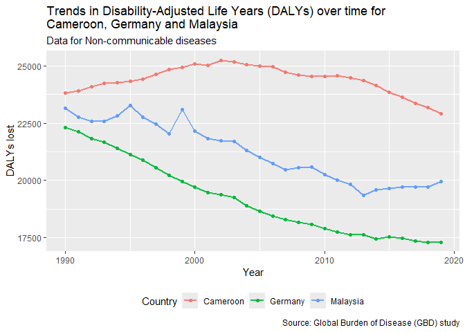

Global Disease Burden Analysis
================
Jobert Richie Nansseu
\_ 2024-07-19

# Introduction

This document compares the Disability-Adjusted Life Year (DALY) diseases
burden for three countries: **Cameroon**, **Germany**, and **Malaysia**.
These countries were chosen based on their location (Africa, Europe, and
Asia) and level of income (low, middle, and high income) for better
comparison.

We compared the burden due to communicable, maternal, neonatal, and
nutritional diseases (CMNN), non-communicable diseases (NCDs), and
overall disease burden for these countries.

The source data is from the Institute for Health Metrics and Evaluation
(IHME) Global Burden of Disease (GBD) study.

# Communicable, Maternal, Neonatal, and Nutritional (CMNN) Diseases Burden

## Table of estimates for CMNN diseases burden over time

| Year | Cameroon | Germany | Malaysia |
|-----:|---------:|--------:|---------:|
| 1990 |    41139 |    1581 |     6396 |
| 1991 |    41501 |    1535 |     6259 |
| 1992 |    42386 |    1468 |     6115 |
| 1993 |    43240 |    1439 |     6066 |
| 1994 |    43790 |    1410 |     6023 |
| 1995 |    44802 |    1355 |     6030 |
| 1996 |    46027 |    1304 |     5735 |
| 1997 |    47235 |    1252 |     5678 |
| 1998 |    48478 |    1219 |     5424 |
| 1999 |    49451 |    1209 |     5521 |
| 2000 |    50333 |    1191 |     5017 |
| 2001 |    50983 |    1186 |     4857 |
| 2002 |    50842 |    1185 |     4758 |
| 2003 |    50675 |    1192 |     4681 |
| 2004 |    49888 |    1180 |     4558 |
| 2005 |    48568 |    1169 |     4472 |
| 2006 |    47215 |    1162 |     4397 |
| 2007 |    45860 |    1165 |     4457 |
| 2008 |    43977 |    1152 |     4606 |
| 2009 |    42111 |    1146 |     4800 |
| 2010 |    40456 |    1135 |     4739 |
| 2011 |    39017 |    1132 |     4790 |
| 2012 |    37394 |    1106 |     4886 |
| 2013 |    36369 |    1100 |     4739 |
| 2014 |    35420 |    1086 |     4882 |
| 2015 |    34056 |    1097 |     4934 |
| 2016 |    32070 |    1104 |     4754 |
| 2017 |    30021 |    1064 |     4637 |
| 2018 |    28132 |    1048 |     4425 |
| 2019 |    26803 |    1036 |     4364 |

## Plot showing trends in CMNN diseases burden over time

<!-- -->

## Summary of CMNN diseases burden findings

We observe that Germany has the lowest DALYs from 1990 to 2019, followed
by Malaysia while Cameroon has the highest DALYs, in perfect correlation
with their income: lower income countries having higher DALYs. From 1990
to 2019, the DALYs for Germany has broadly remained constant while that
for Malaysia has slightly decreased. In Cameroon, the DALYs has greatly
increased between 1990 and 2001 before a sharp decrease up to 2019.

## Cumulative CMNN diseases burden for the three countries over time

<!-- -->

The cumulative trend for the three countries shows an increasing burden
from 1990 to 2001, then an exponential decrease up to 2019.

# Non-Communicable Diseases (NCDs) Burden

## Table of estimates for NCDs burden over time

| Year | Cameroon | Germany | Malaysia |
|-----:|---------:|--------:|---------:|
| 1990 |    23834 |   22296 |    23171 |
| 1991 |    23923 |   22124 |    22760 |
| 1992 |    24090 |   21812 |    22581 |
| 1993 |    24248 |   21664 |    22580 |
| 1994 |    24283 |   21399 |    22823 |
| 1995 |    24325 |   21138 |    23285 |
| 1996 |    24420 |   20877 |    22773 |
| 1997 |    24648 |   20546 |    22451 |
| 1998 |    24841 |   20215 |    22044 |
| 1999 |    24934 |   19945 |    23104 |
| 2000 |    25109 |   19696 |    22151 |
| 2001 |    25021 |   19458 |    21813 |
| 2002 |    25259 |   19366 |    21727 |
| 2003 |    25198 |   19251 |    21711 |
| 2004 |    25069 |   18893 |    21303 |
| 2005 |    25013 |   18654 |    21003 |
| 2006 |    24975 |   18426 |    20721 |
| 2007 |    24737 |   18282 |    20476 |
| 2008 |    24600 |   18173 |    20562 |
| 2009 |    24557 |   18058 |    20599 |
| 2010 |    24561 |   17892 |    20243 |
| 2011 |    24576 |   17744 |    20005 |
| 2012 |    24498 |   17627 |    19813 |
| 2013 |    24381 |   17617 |    19344 |
| 2014 |    24164 |   17448 |    19576 |
| 2015 |    23862 |   17534 |    19656 |
| 2016 |    23631 |   17451 |    19697 |
| 2017 |    23368 |   17331 |    19698 |
| 2018 |    23174 |   17292 |    19711 |
| 2019 |    22920 |   17277 |    19936 |

## Plot showing trends in NCDs burden over time

<!-- -->

## Summary of NCDs burden findings

Mimicking the observation for CMNN diseases, Cameroon has the highest
DALYs for NCD, followed by Malaysia and Germany with the lowest one, the
situation remaining the same over time. In Cameroon, the DALYs increased
from 1990 to 2002 before decreasing up to 2019. In Malaysia and Germany,
there was an overall decreasing trend over time, with a fairly sharp
decrease in Germany.

## Cumulative NCDs burden for the three countries over time

<!-- -->

The cumulative trend for NCD burden yields an overall sharp decreasing
pattern over time.

# Overall Diseases Burden

## Table of estimates for overall diseases burden over time

| Year | Cameroon | Germany | Malaysia |
|-----:|---------:|--------:|---------:|
| 1990 |    68930 |   26732 |    32954 |
| 1991 |    69482 |   26500 |    32380 |
| 1992 |    70568 |   26046 |    31955 |
| 1993 |    71637 |   25804 |    31911 |
| 1994 |    72297 |   25461 |    32084 |
| 1995 |    73505 |   25099 |    32649 |
| 1996 |    74680 |   24728 |    31873 |
| 1997 |    76181 |   24260 |    31414 |
| 1998 |    77749 |   23815 |    30672 |
| 1999 |    78779 |   23470 |    31990 |
| 2000 |    79861 |   23138 |    30290 |
| 2001 |    80371 |   22815 |    29646 |
| 2002 |    80568 |   22676 |    29402 |
| 2003 |    80376 |   22517 |    29354 |
| 2004 |    79357 |   22063 |    28784 |
| 2005 |    77986 |   21747 |    28322 |
| 2006 |    76593 |   21464 |    27897 |
| 2007 |    74924 |   21290 |    27654 |
| 2008 |    72828 |   21142 |    27897 |
| 2009 |    70860 |   21008 |    28153 |
| 2010 |    69233 |   20819 |    27660 |
| 2011 |    67801 |   20644 |    27436 |
| 2012 |    66034 |   20467 |    27299 |
| 2013 |    64866 |   20436 |    26583 |
| 2014 |    63915 |   20235 |    27023 |
| 2015 |    62262 |   20351 |    27145 |
| 2016 |    59839 |   20295 |    27014 |
| 2017 |    57413 |   20153 |    26908 |
| 2018 |    55421 |   20099 |    26686 |
| 2019 |    53559 |   20075 |    26887 |

## Plot showing trends in overall diseases burden over time

<!-- -->

## Summary of overall diseases burden findings

The burden due to CMNN diseases seem to be the major contributor to the
overall diseases burden, as the trends for overall diseases mimics that
for CMNN ones. DALYs for Germany is the lowest while that for Cameroon
is the highest, this being the same over time. In Cameroon, the DALYs
for overall diseases increased from 1990, peaked in 2002 and then
decreased sharply until 2019. In Germany and Malaysia, there was a
slight decrease over time.

## Cumulative overall diseases burden for the three countries over time

<!-- -->

Data point out a slight increasing trend from 1990 to 1999 when a peak
was observed, then a decreasing trend until 2019.
